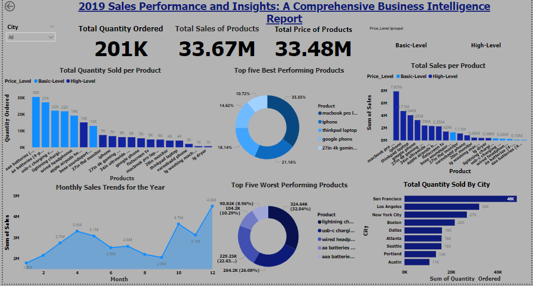

# Analysis-on-2019 sales-transactional-data

1. Business Understanding:
 Objective:
Analyze the client’s transactional data from 2019 to identify opportunities to drive more sales and improve operational efficiency.

Key Business Questions:
1. How much revenue was generated in 2019?
2. Are there any seasonal trends in the sales data?
3. Which products performed the best and worst?
4. How do sales in different months and weeks compare?
5. Which cities received the most product deliveries?
6. How do different product categories perform in terms of revenue and quantity sold?
7. Identify additional insights to inform business strategies.

Constraints:
Products priced above $99.99 are categorized as "High-Level," while others are "Basic-Level."

2. Data Understanding:
Data Sources:
Excel Files: Sales data from January to June 2019 stored in CSV format.
Database: Sales data from July to December 2019 stored in a remote SQL database.
Data Collection:
Import CSV files for the first 6 months.
Connect to the remote database and extract data for the last 6 months.
Initial Data Exploration:
Check for missing data, inconsistencies, and data types.
Get an overview of sales trends, product lists, pricing, and delivery locations.

3. Data Preparation:
Data Cleaning:
Handle missing values and correct data inconsistencies.
Standardize formats across CSV and database data.
Data Integration:
Combine data from both sources into a unified dataset for the entire year.
Feature Engineering:
Create new features such as product level ("High-Level" or "Basic-Level") based on unit price.
Generate time-based features (e.g., month, week) to analyze trends.
Label and categorize products by their revenue contribution and quantity sold.

4. Modeling:
Sales Analysis:
Calculate total revenue, monthly, and weekly sales comparisons.
Identify seasonality in sales using time-series analysis.
Rank products by sales performance (best-selling vs. worst-selling).
Compare sales across cities and product categories.
Product Categorization:
Apply conditions to label products as "High-Level" or "Basic-Level."
Visualization:
Use visual tools to illustrate trends, seasonality, and comparisons (e.g., bar charts, line graphs, heat maps).

5. Evaluation:
Validation:
Ensure all business questions are addressed with the analysis.
Validate the consistency and accuracy of the data.
Business Insight:
Summarize key findings, such as peak sales periods, top-performing products, and geographic hotspots.
Provide recommendations for increasing sales and improving operational efficiency based on insights.

6. Deployment:
Report Generation:
Create a comprehensive report that answers all key business questions.
Include visualizations and key metrics to support decision-making.
Presentation:
Present the findings to the client, highlighting actionable insights.
BI Solution:
Recommend setting up a dashboard for real-time sales monitoring.
Suggest future data collection improvements for better analysis.
This outline provides a structured approach to solving the client's business problem using the CRISP-DM methodology, ensuring a thorough and systematic analysis of their 2019 sales data.

